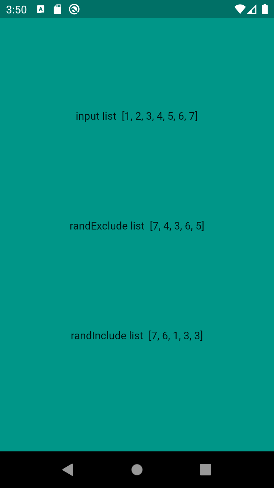

<!-- 
This README describes the package. If you publish this package to pub.dev,
this README's contents appear on the landing page for your package.

For information about how to write a good package README, see the guide for
[writing package pages](https://dart.dev/guides/libraries/writing-package-pages). 

For general information about developing packages, see the Dart guide for
[creating packages](https://dart.dev/guides/libraries/create-library-packages)
and the Flutter guide for
[developing packages and plugins](https://flutter.dev/developing-packages). 
-->


## Random_List

Create a new list based on a list whose items are randomly selected.


## Features

* Set an input list to randomize from
* Set number of random selections
* Use randInclude() method so input list's items can be randomly selected more than once
* Use randExclude() method so input list's items can be randomly selected only once


## Usage

```
List randExnclude=Random_List(list: [1,2,3,4,6,7],iterations: 5).randExclude();
List randInclude=Random_List(list: [1,2,3,4,5],iterations: 4).randInclude();   
```

## Parameters

Here are the accepted parameters :

| Name  | Type | Default Value | Description | 
| ------------- | ------------- | ------------- | ------------- | 
| list  | List | null | Input list given by the user to randomize from | 
| iterations  | int | null | Number of random selections from input list; Output list's length. |


## example




